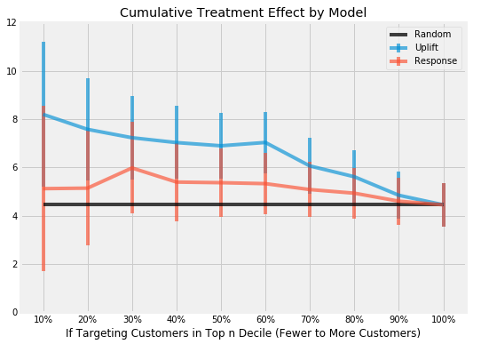

# Uplift Modelling

Understanding whether or not a direct marketing campaign will have a positive impact on a particular customer is a causal inference problem which involves anticipating [what would have happened if the customer was not marketed to](https://en.wikipedia.org/wiki/Impact_evaluation#Counterfactual_evaluation_designs). We can use ML to solve this problem by performing [uplift modelling](http://proceedings.mlr.press/v67/gutierrez17a/gutierrez17a.pdf) on randomized experimental data consisting of control and treatment group observations. Such data is already extensively collected by companies who perform conversion rate optimization or A/B testing to decide whether or not to implement changes to the business. The literature for uplift modelling is established but not widely popular among the Data Science community and decent non-commercial packages are recently becoming available (e.g. [1](https://tech.wayfair.com/data-science/2018/10/pylift-a-fast-python-package-for-uplift-modeling/), [2](https://github.com/uber/causalml)).

In this project, I used Pylift to reproduce the methodology from a relatively recent [marketing paper](https://journals.sagepub.com/doi/full/10.1509/jmr.16.0163) to analyze a well known [uplift modelling dataset](https://blog.minethatdata.com/2008/03/minethatdata-e-mail-analytics-and-data.html). Specifically the model is tasked with being able to predict which customer groups are most likely to visit the website of a company **as a result of** direct marketing efforts i.e. an E-Mail campaign. This is measured by the visit rate uplift of the E-Mail campaign for different customer deciles created by the model, where customers with the largest model predicted uplift should be targeted first by the E-Mail campaign. The model is trained on a training set and evaluated on a test set just like any other supervised ML setting.

Compared to building a standard classifier that predicts which customers are most likely to visit the website and directly marketing to them, the uplift model achieves a statistically significant increase in visit rate uplift by instead targeting customers who are predicted to have the largest visit rate uplift directly based on the same known information. More details on the train/test split and the methodology can be seen in the notebook and the reference paper.

**Notes/Future work**

- Continue reviewing the literature in order to gain a better understanding of the uplift model training and prediction process
- Non-clinical datasets are limited and are usually [heavily anonymized](http://ailab.criteo.com/criteo-uplift-prediction-dataset/) which makes experimenting with these models difficult. Find more datasets to experiment with

