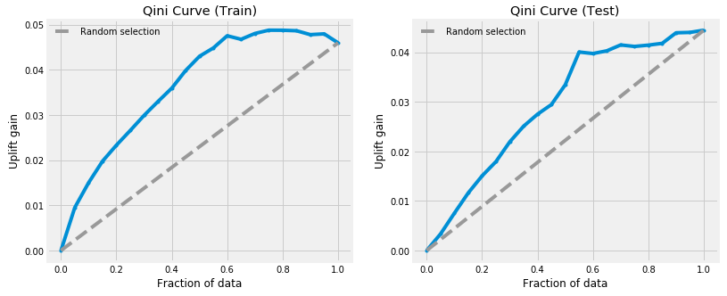

# Uplift Modelling

Understanding whether or not a direct marketing campaign will work on a particular customer is a causal inference problem which involves anticipating [what would have happened if the customer was not marketed to](https://en.wikipedia.org/wiki/Impact_evaluation#Counterfactual_evaluation_designs). We can use ML to solve this problem by performing [uplift modelling](http://proceedings.mlr.press/v67/gutierrez17a/gutierrez17a.pdf) on randomized experimental data consisting of control group (not marketed to) and treatment group (marketed to) observations. Such data is already extensively collected by companies who, for example, perform conversion rate optimization or A/B testing to decide whether or not to implement changes to the business. The literature for uplift modelling is established but not widely popular among the Data Science community whilst decent non-commercial packages are just recently becoming available (e.g. [1](https://tech.wayfair.com/data-science/2018/10/pylift-a-fast-python-package-for-uplift-modeling/), [2](https://github.com/uber/causalml)).

In this project, I used Pylift to reproduce the methodology of a recent [marketing paper](https://journals.sagepub.com/doi/full/10.1509/jmr.16.0163) to analyze a well known [email marketing campaign dataset](https://blog.minethatdata.com/2008/03/minethatdata-e-mail-analytics-and-data.html). I built an uplift model which was tasked with being able to predict which customers are most likely to visit the website of a company **as a result of** direct marketing efforts, specifically an E-Mail campaign. The uplift of the email on a customer visiting the website is the difference between the probability that the customer visits the website given the treatment and the probability that the customer visits the website given no treatment.

The idea is that, on average for the entire customer base, the email campaign will lead to more website visits. But all customers are different. Customer heterogeneity means that the email campaign should work better for some customer groups compared to others depending on their features. Can we use these features to find subgroups of customers for which the uplift is significantly greater than the population average uplift?

**Notes/Future work**

- Compare the performance of Pylift's transformed outcome method to the Two-Model-Approach
- Non-clinical datasets are limited and are usually [heavily anonymized](http://ailab.criteo.com/criteo-uplift-prediction-dataset/) which makes experimenting with these models difficult. Find more datasets to experiment with

## Installation

Simply clone the repo and install all dependencies listed in the requirements.txt file to an environment of your choice.

## Usage

All results and plots can be reproduced using the Uplift_Modelling.ipynb notebook.
